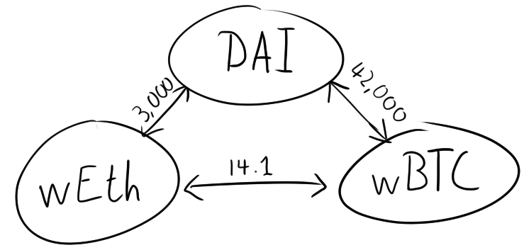

## Hidden Paths and Arbitrage
Inspired by @derked\_eth's recent article on his adventure into the world of long tail MEV, I decided to write about my own story.  

This article will feature both an example, and how that example can be generalized to a broader approach for finding hidden MEV opportunities.  

---

### What is Arbitrage?
"Arbitrage is the simultaneous purchase and sale of the same asset in different markets in order to profit from tiny differences in the asset's listed price. It exploits short-lived variations in the price of identical or similar financial instruments in different markets or in different forms." - Investopedia  

Arbitrage abound in DeFi and the broader crypto ecosystem. There exist thousands of trading pairs between different tokens, and often multiple identical pairs on different DEXes and CEXes.  

To model the problem, you can imagine each token being a node in a graph, and each trading pair a weighted edge.  

Big arbitrage bots look for imbalances in the grand web of trading pairs. Since tokens can have multiple pairs with other tokens, which in turn have pairs with many of the same tokens. You can imagine how many routes there are to take, and all you have to do is find a route that lands you back, at where you started, with more than you set out with.  

Now these CEX trading pairs are some of the most competitive hunting grounds for the biggest monsters of the Dark Forest[Link to the dark forest article]. They tune their arbitrage smart contracts to be as gas effective as possible, and pay a majority of their profits to miners, through Flashbot auctions. That was way too much heat for a small fish like, I'm just trying to make a little bit of money here.  

### Hidden Paths
I enjoyed arcade racing games a lot as a kid. Mario Kart and Need for Speed especially. A staple of those games are the hidden shortcut. A path you take to shave a few seconds off a lap time, usually requiring specialized knowledge or skill. A similar concept exists in long-tail arbitrage.  

When looking for arbitrage in the grand trading pair graph, leaf nodes are generally considered uninteresting. If there's only one way to and from a token, then you're always going to make a loss from visiting it. But not every leaf node is as isolated as it looks. This is where hidden shortcuts come in. Invisible to generalized arbitrage bots, but exploitable by more custom-tooled specimens.  

Enter Pendle. @Pendle is a DeFi protocol for turning variable yield tokens, into fixed yield tokens. The way the protocol accomplishes this is simple: It splits the yield generating token into two distinct tokens; a yield token(yt) representing the yield earned up until maturity, and a collateral token(ot) representing the underlying collateral. To earn a fixed yield, one can supply a yield bearing token, say Aave USDC(aUSDC), split it into ytaUSDC and otaUSDC, sell the ytaUSDC and wait until maturity to redeem the otaUSDC.  

However, there's a different mechanism for redeeming your yt and ot. If you have an equal amount of both, you can redeem them for the underlying, before maturity. Here we find our shortcut.  

[Insert drawing of leaf nodes, connected by pendle]

Now, this shortcut wasn't very enticing for the Aave USDC or Compound DAI pairs. The markets moved slowly, and gas fees would eat most of the profit. Even worse was that I couldn't let the arbitrage get too big, as I noticed a couple of manual arb hunters out there. Respect the hustle though. Luckily, Pendle launched a far more lucrative trade: Fixed yield on Sushiswap LP positions, mainly Pendle-Eth and Eth-USDC. Now these tokens were way more volatile than their interest bearing counterparts. This meant that imbalances moved with the market, and instead of having to wait for a steady stream of interest to cause a profitable imbalance, instead I could merely let the cryptomarket be it's volatile, lovely self, as I was the only one rebalancing this small trading pair.  

### All good things come to an end

Alas, nothing lasts forever and eventually competition showed up. My profits shrinked, and the other party was clearly more experienced than a first timer like me, so I abandoned the arb. Though it was definitely an profitable, educational and most importantly, entertaining little hustle. Reiterating the importance of taking the road less traveled.  

